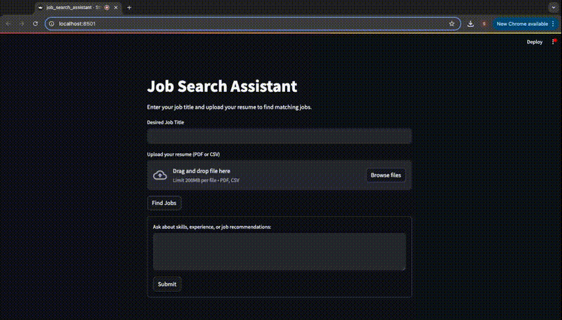

# Job Search Assistant with RAG and LangChain

## Overview
This Job Search Assistant is an AI assistant designed to help users find job opportunities based on their desired role and resume. It leverages OpenAI's API and LangChain for intelligent responses, with a Streamlit-powered UI.

## Demo

The Streamlit Demo can be run by 
'''bash
python -m streamlit run jobsearch-assistant.py
'''

## Features
- Job Recommendations: Users input their desired role and upload their resume to receive tailored job recommendations
- Personalized Job Search: The chatbot matches job postings based on the user's skills and experiences
- Chat Interface: Users ask career-related questions and receive AI-powered responses
- Conversational Memory: The chatbot retains context from previous queries, allowing for a natural and seamless conversation flow
- Streamlit UI: Provides an interactive and user-friendly interface

## Technologies Used
- Python
- OpenAI API
- Streamlit
- LangChain
    - Used to chain together various model components for enhanced functionality
- Retrieval-Augmented Generation (RAG)
    - Used to retrieve relevant job postings 
- Prompt Engineering
    - Used to guide the chatbot's answers for more relevant and accurate responses
- Conversational Memory 
    - Used to retain information for a more seamless conversation 
- Vector Database
    - Used for efficient storage of job posting embeddings, enabling fast and relevant job search results

## Installing
1. Clone the repository
'''bash
git clone https://github.com/yourusername/job-search-chatbot.git
cd job-search-chatbot
'''
2. Install dependencies
'''bash
pip install -r requirements.txt
'''
3. This chatbot is using Open AI GPT-3.5 turbo, so you will have to set the 'OPENAI_API_KEY' environment variable
4. Run the Streamlit app
'''bash
python -m streamlit run jobsearch-assistant.py
'''
or
'''bash
streamlit run jobsearch-assistant.py
'''

## How to Use the Job Search Assistant
1. Enter a desired job title
2. Upload your resume (PDF or CSV format)
3. Click Find Jobs to receive job recommendations
4. Use the chatbox to ask questions about skills, experience, cover letters, etc. 

## Future Improvements
1. Enhance job retrieval with LinkedIn API or a broader database
2. Improve resume parsing and job matching
3. Skill matching
    - Allow users to analyze skill gaps between their resume and job descriptions.
4. Job Application Tracking
    - Allow users to monitor their applications, and provide relevant job search metrics.

## Contributing
Pull requests are welcome! Please ensure any changes are well-documented

## License
This project is licensed under the MIT license